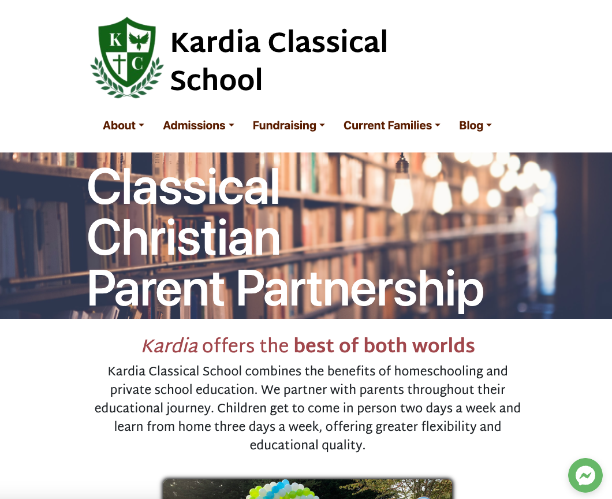

# Kardia Classical School Site
This site was built using ReactJS for Kardia Classical School in Snohomish, WA. The school contracted me to update their site and make it more snazzy and user-friendly. 

[Visit Kardia Classical School Website](kardiaclassical.org)

I have continued to work with Kardia to keep the site's content up-to-date and to ensure it is meeting their needs.

## Features
One set of features the staff at Kardia were excited to see on their site was the parallax scrolling effect on background image of the title of each of the main pages. This 'Hero' component I built as a react component that was reusable and could be easily modified to the needs of the client.

Another feature that has been helpful was the StaffList component. It maps through the array of current faculty/staff at the school and populates the page with their headshot, bio, etc. This makes it so that I just have to update the array as the individuals are added or leave the staff.